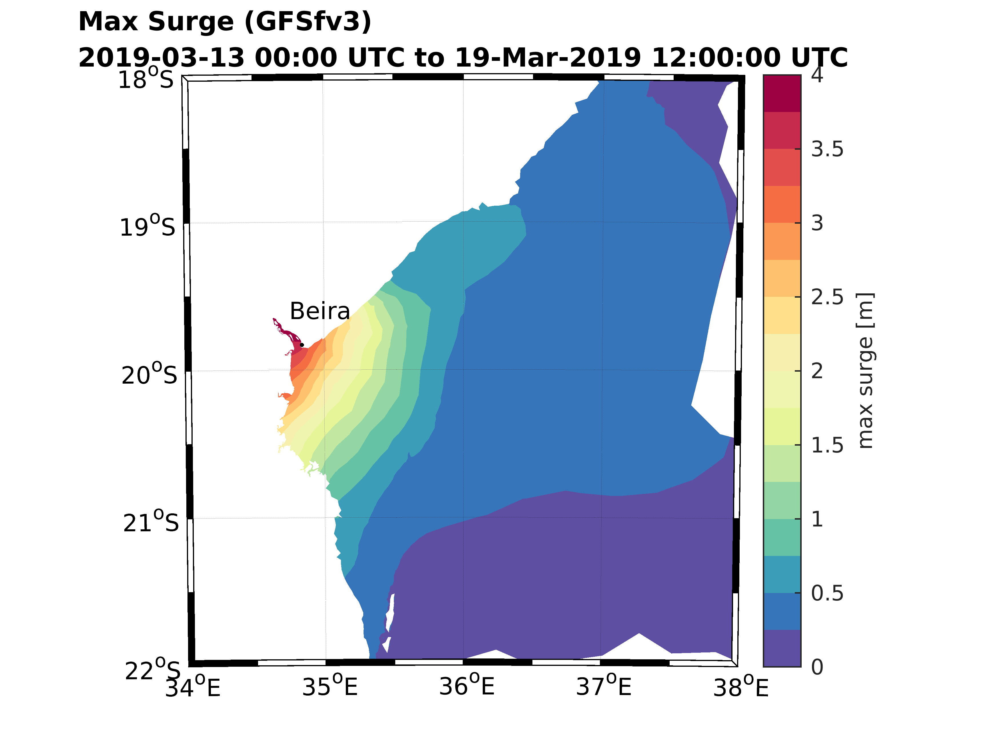
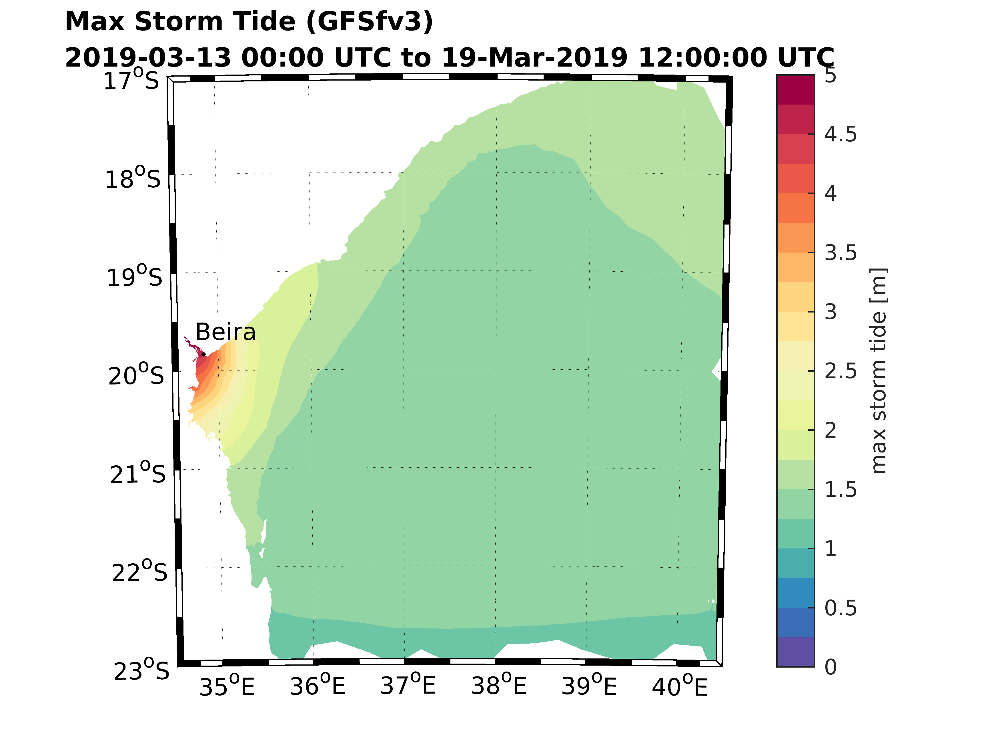

# Latest Forecast

## Tropical Cyclone Idai

### Maximum Surge 



### Maximum Storm Tide (Surge + Astronomical Tide) 



### Local mesh used


## How are the Forecasts Obtained?

Forecasts are 2D barotropic model ocean circulation and inundation simulations on unstructured triangular meshes subject to meteorological and astronomical forcings which drive surge and tide respectively. 

The meshes have been automatically generated using the [OceanMesh2D](https://github.com/CHLNDDEV/OceanMesh2D) Matlab meshing toolbox. A single seamless unstructured mesh is used for each forecast. The default mesh which covers the entire Earth has a variable coastal resolution ranging between 2 km and 10 km depending on shoreline complexity. Moreover, when a storm is predicted to make landfall a higher-resolution (~90 m) inset around the forecasted landfalling region is automatically merged into the global mesh to provide accurate forecasts of extreme water levels and flooding in the landfall region. In this way we can minimize the computational resources in order to provide timely forecasts without sacrificing accuracy where coastal flooding occurs.

### Inputs and Sources
- Meteorology: FV3-GFS model 10-m wind velocities (U10 and V10) and pressure reduced to mean sea level (PRMSL). [Link for latest 2-day - archive of forecasts](https://para.nomads.ncep.noaa.gov/pub/data/nccf/com/gfs/para/)
- Topography/Bathymetry: Default for the Earth: [STRM15_PLUS](https://topex.ucsd.edu/WWW_html/srtm15_plus.html)
- Shoreline Geometry: Default for the Earth: [GSSHG](http://www.soest.hawaii.edu/wessel/gshhg/)

## Welcome to GitHub Pages

You can use the [editor on GitHub](https://github.com/WPringle/Advanced-Global-Coastal-Flood-Forecasting-System/edit/master/README.md) to maintain and preview the content for your website in Markdown files.

Whenever you commit to this repository, GitHub Pages will run [Jekyll](https://jekyllrb.com/) to rebuild the pages in your site, from the content in your Markdown files.

### Markdown

Markdown is a lightweight and easy-to-use syntax for styling your writing. It includes conventions for

```markdown
Syntax highlighted code block

# Header 1
## Header 2
### Header 3

- Bulleted
- List

1. Numbered
2. List

**Bold** and _Italic_ and `Code` text

[Link](url) and  
```

For more details see [GitHub Flavored Markdown](https://guides.github.com/features/mastering-markdown/).

### Jekyll Themes

Your Pages site will use the layout and styles from the Jekyll theme you have selected in your [repository settings](https://github.com/WPringle/Advanced-Global-Coastal-Flood-Forecasting-System/settings). The name of this theme is saved in the Jekyll `_config.yml` configuration file.

### Support or Contact

Having trouble with Pages? Check out our [documentation](https://help.github.com/categories/github-pages-basics/) or [contact support](https://github.com/contact) and we’ll help you sort it out.
